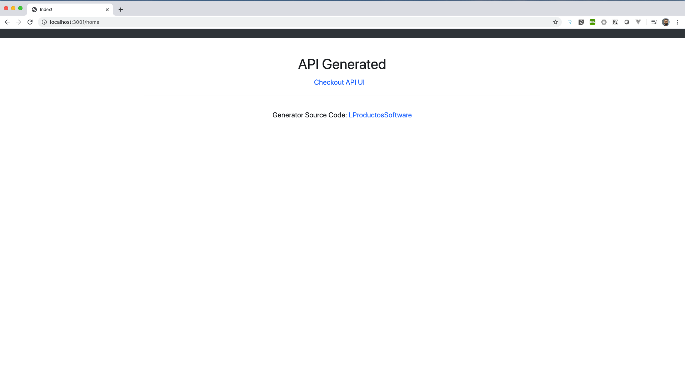
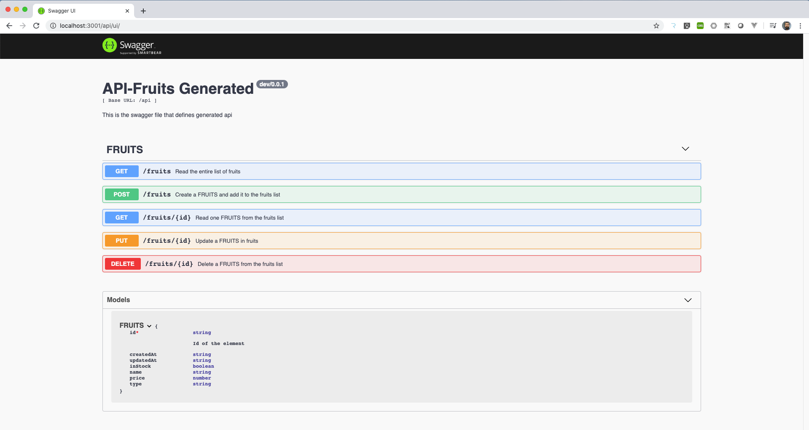
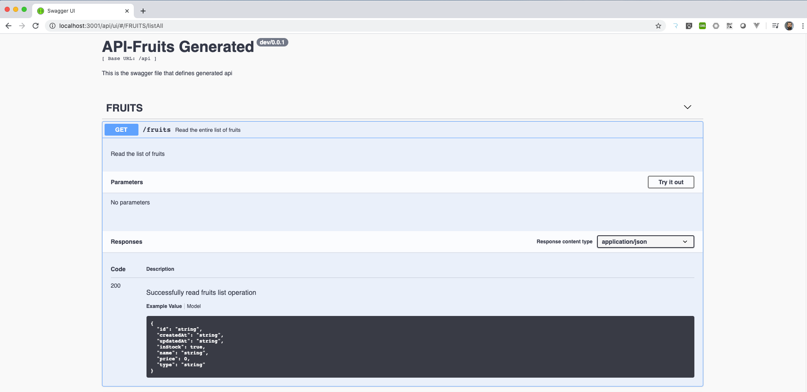
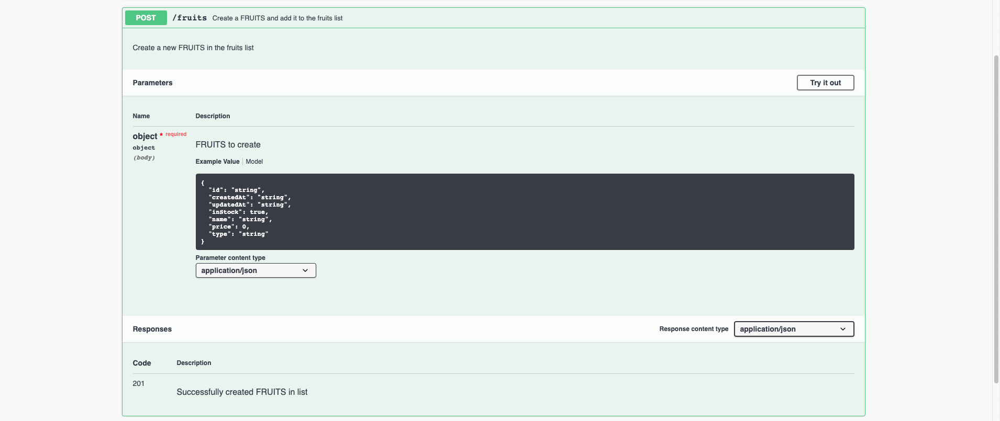
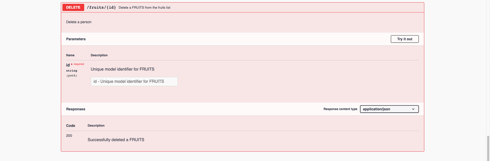

# LProductosSoftware

## Description
Desarrollo De Lineas De Producto Software.
 
This project aims to api/rest generation from a data model represented with a json 
file format. This generator is develop with golang using interfaces and templates engine.
Can produce API/Rest services in Go, JavaScript and Python technologies. 


From a high level representation model like this:
```
{
   "type":"Apple",
   "name": "Golden",
   "price":1.5,
   "inStock":true
}
```

this software produces a swagger specification file that is used by the servers to define api end-points.
Generator produces source code to satisfy CRUD operations over the generated APIs. In Addition, specification files
can render to server user interfaces from APIs


### Getting started

Clone this source code repository:
```
git clone http://git.git
```

Open generator environment docker based. Dockerfile is provide with all dependencies requires to
generate and run Api-Rest services, so user requires Docker engine installed in his default operating system.
This docker image is available at [DockerHub](https://hub.docker.com/r/hugobarzano/dlps). You can start working
executing:


```
make run-docker
```

This instruction will open a bash command-line inside a docker-container
with this project mounted as current workspace, so user can start to generate
services.

**Note**: Port bind is setup for range 3000 to 3050,
so use this ports to consume your APIs. 

You can build generator binary with:

```
make build-generator
```

Checkout generator help:

```
# ./generator.linux -h
Usage of ./generator.linux:
  -input string
        Input generation spec file (json) format
  -name string
        Application name to be generated
  -output string
        Output directory to generated source-code
  -port int
        TCP port of generated application (default 3000)
  -tech string
        Technology to generate: go, python, js (default "go")

``` 

In order to use generator capabilities you can start generating a javascript API but
in the same way you can work with python or golang: 

``` 
# ./generator.linux -input resources/input/fruits.json \
                    -output resources/output/ \
                    -name fruits \
                    -port 3001 \
                    -tech js
```

Generated source code can be found withing **resources/output/js/fruits** folder. To run this API: 

``` 
# cd resources/output/js/fruits/
# npm install   // Install API dependencies 
# node server.js  // run API
```
 
Open a web browser and navigate to [http://localhost:3001/home](http://localhost:3001/home)



Navigate to [http://localhost:3001/api/ui/](http://localhost:3001/api/ui/) or click on **Checkout API UI** link in the **/home** path view 
of the generated API to checkout User Interface. This UI allows to performs CRUD operations over the generated model.



- List all fruits
    
- Create one fruit
    
- Get one fruit by ID (auto-generated field)
    
- Update one fruit by ID (auto-generated field)
    
- Delete one fruit by ID (auto-generated field)
    
    

Generated resources:
  
- [Api Specification and Model](resources/output/js/fruits/spec/spec.yml)
- [Api Main Server](resources/output/js/fruits/server.js)
- [Api Source Code](resources/output/js/fruits/api/index.js)
- [Home View](resources/output/js/fruits/templates/index.html)
- [Api Dependencies: package.json](resources/output/js/fruits/package.json)


You can use **python** as technology:
``` 
# ./generator.linux -input resources/input/fruits.json \
                    -output resources/output/ \
                    -name fruits \
                    -port 3002 \
                    -tech python
```

and checkout generated resources: 

- [Api Specification and Model](resources/output/python/fruits/spec/spec.yml)
- [Api Main Server](resources/output/python/fruits/server.py)
- [Api Source Code](resources/output/python/fruits/api.py)
- [Home View](resources/output/python/fruits/templates/index.html)
- [Api Dependencies: requirements.txt](resources/output/python/fruits/requirements.txt)

To run fruits API python based: 

``` 
# cd resources/output/python/fruits
# pip install -r requirements.txt   // Install API dependencies 
# python server.py  // Run API
```
Open a web browser and navigate to [http://localhost:3002/home](http://localhost:3002/home)

### Working with Golang: Complex Data models

From a high level representation model like this:
```
{
   "name":"Cesar Hugo",
   "age":26,
   "car":true,
   "address":{
      "street":"rivadavia",
      "city":"Granada",
      "number":4
   },
   "hobbies":[
      "tech",
      "music",
      "animals"
   ]
}
```
The approach to generate APIs with golang technology changes.

``` 
# ./generator.linux -input resources/input/complexModel.json \
                    -output resources/output/ \
                    -name students \
                    -port 3003 \
                    -tech go
```

With this technology **spec.yml** file can not be used as API routes path, so 
this logic is generated too, checkout [Api Main Server](resources/output/go/students/server.go). In the other hand, this generator has been develop with GO, so complex models can be
natively generated, checkout [Generated Complex Model](resources/output/go/students/model/model.go)

To run students API go based: 

``` 
# cd resources/output/go/students
# go run server.go  // Run API
```

In addition, swagger and the generated spec file can be used to produces another resources or 
customize generated base code. Checkout [Swagger documentation](https://swagger.io/). 

<br>
<br>
<hr>


***This App has been generated***

***Timestamp*** 2020-03-10 19:42:37.712697 +0100 CET m=+0.000015661

gcm/0.0.0
  [source-code](https://github.com/hugobarzano/GCM)
     ***Powered by CesarCorp***
<hr>
